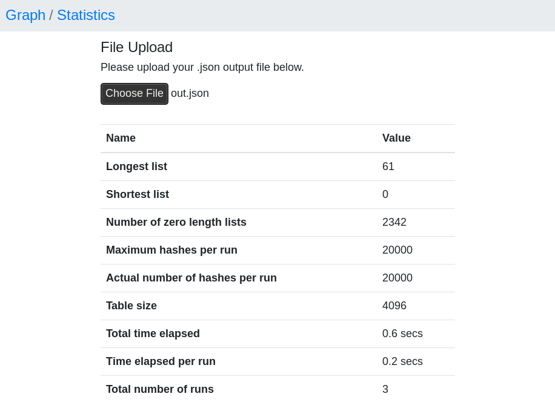
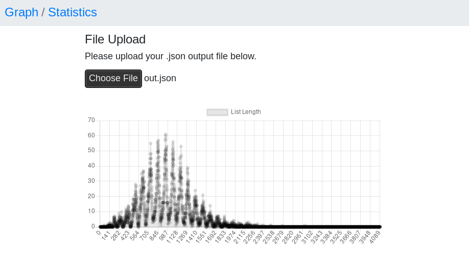

# hashtest
## Overview
`hashtest` is a utility for evaluating [hashing functions](https://en.wikipedia.org/wiki/Hash_function). It was created because there is no one, ideal hashing algorithm that performs equally well on all possible kinds of input and because it is sometimes difficult to benchmark a function in the context of a larger project. With very few lines of code, `hashtest` implements a test runner which takes an arbitrary hashing function and runs it multiple times while collecting various performance statistics. `hashtest`s backend is implemented in **C**, with a **JavaScript** frontend for visualization of results.

## Installation
`hashtest` does not have any dependencies, except for a **C** compiler, `libc` and `make`. Compilation is as easy as running:

```bash
make       # creates a binary in `build/'
make test  # compiles and tests the binary in one step
make clean # removes the binary and all object files
```

Please open an issue if you encounter any bugs!

## Running a Test
The hashing function to test is compiled into the binary. Before following the installation instructions, change `size_t hash(char *, unsigned int)` in `src/config.h` to your algorithm (make sure to keep the function signature, though!):

```c
size_t hash(char *str, unsigned int tbl_size)
{
    /* hashing function goes here */
}
```

A test configuration is provided via options to the binary. For an overview, type:

```bash
hashtest -h
```

Test values for hashing are provided via a file (see `data/` for two examples). The output of a test run is saved to `out.json` by default. If `hashtest` was compiled with `-DDEBUG`, test results are printed to `stderr`, too.

## Viewing Test Results
To view the result in a convenient way, open `/ui/index.html` in a browser. Upload the test output file to be able to inspect statistics or a graphical representation of the hash table which was generated during the tests. This helps e.g. to identify certain hashes that might be overrepresented.

### Statistics Output


### Graph Output


## License
Code in this repository is licensed under the [GPLv3 license](./LICENSE.md).
